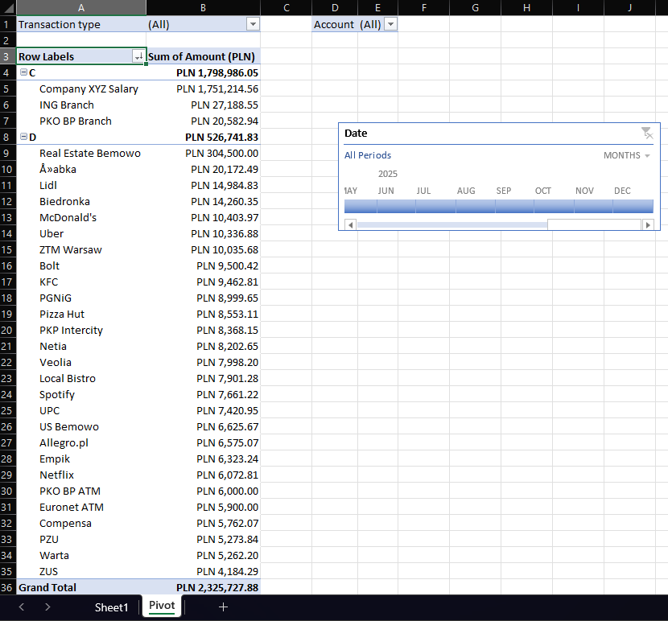

# Bank Transactions Analyzer

This project is a macro-powered Excel tool for importing, transforming, and analyzing bank transaction data with ease.

It allows users to:
- Import `.csv` transaction files
- Automatically transform and clean data using Power Query
- Generate a PivotTable with interactive slicers and filters
- View income vs. expenses, transaction types, counterparties, and more

---

## 📊 Features

- 📂 **File Picker**: Choose your `.csv` bank statement using a button
- ⚙️ **Power Query Integration**: Automatically transforms raw data
- 📉 **PivotTable**: Summarizes transactions by type, account, and description
- 📆 **Timeline Slicer**: Filter data by date using an interactive slicer
- 💸 **PLN Currency Formatting**: All amounts are formatted for Polish złoty
- 📌 **No coding required** for the user — just click the import button

---

## 🗂 Sample File

This repository includes a [sample_transactions.csv](sample_transactions.csv) file with ~1,000 realistic transactions for demonstration.

---

## 📷 Screenshots

> Shows automated PivotTable with slicer and categorized spending.
## ✅ How It Works

1. Click the "Import Transactions" button
2. Choose a `.csv` file
3. A new workbook is created with a formatted PivotTable dashboard
---

## 📦 Files

| File | Description |
|------|-------------|
| `Bank_Transaction_Analyzer.xlsm` | Main macro-enabled Excel workbook |
| `sample_transactions.csv` | Sample data for testing |
| `README.md` | Project documentation |
| `screenshots/` | Visuals of the tool |

---

## 🚀 How to Use

1. Download or clone this repo
2. Open `Bank_Transaction_Analyzer.xlsm` in Excel
3. Click the **Import Transactions** button
4. Select your CSV file
5. A new workbook will be created with a PivotTable dashboard

> 📌 Macros must be **enabled** for this tool to function

---

## 📁 Tools Used

- **Excel VBA** (for automation)
- **Power Query** (for ETL)
- **PivotTables & Slicers** (for reporting)
- **CSV Data Format** (as input)

---

## 📌 Author

Farid Pashazade  
Warsaw, Poland 🇵🇱  
📧 [faridpashap@gmail.com](mailto:faridpashap@gmail.com)

---

## 🧠 License

This project is open-source and free to use for educational and demonstration purposes.
